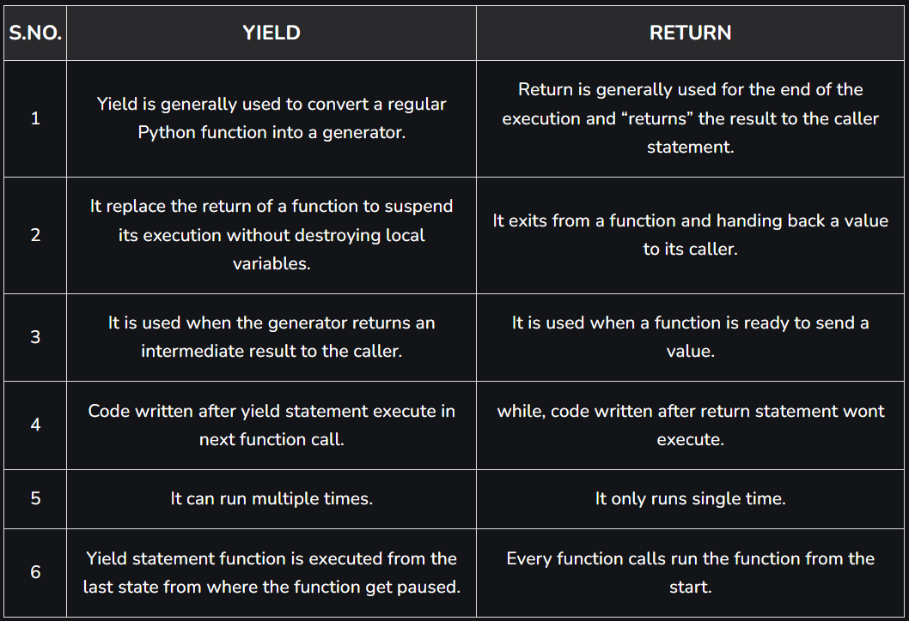

# **Generators in Python**

Date: July 7, 2025 → July 7, 2025
Parent item: Python advantage (generator, OOP, multithreading,...) (https://www.notion.so/Python-advantage-generator-OOP-multithreading-227b0c82c0f280a4adb8e7e8fdbcd407?pvs=21)
Status: Done

Generators (bộ sinh) are lazy function likes Python function. But only when they needed. The main purpose of using generators is to save memory and calculation when processing big datasets.

A Python generator is indicated by the `yield` keyword.

## 1. Then what is $yield$ keyword ?

In Python, the `yield` keyword is used to create generators, which are special types of iterator that allow values to be produced lazily, one at a time, in stead of returning tem all at once. This make `yield` particularly useful for handing large datasets efficiently, as it allows iteration without store the entire sequence in memory.

Advantages of using `yield`

- Memory efficient: Since the function doesn’t store the entire result in memory, it is useful for handling large data sets
- State retention (duy trì trạng thái): Variables inside the generator function retain their state between calls.
- Lazy evaluation: Values are generated on demand rather than all at once.

Disadvantage of using `yield`

- Complexity: Using `yield` can make code harder to understand and maintain, especially for beginners.
- State management: Keeping track of the generator’s state requires careful handling.
- Limited use cases: Generators do not support indexing or random access to elements.

### 1.1 A minimalistic example.

Calling the `powers()` function initializes the generator. Every time `next()` is called, it pulls out one value from the generator.

```python
def powers():
	yield 1
	yield 2
	yield 4
	yield 8
	yield 16

gen = powers()
print(next(gen))
print(next(gen))
print(next(gen))
```

### 1.2 Lazy evaluation

Note that the results of the generator are not pre-calculated. Every call of `next()` executes the code inside the generator function until it encounters the next `yield` statement.

```python
def count():
	for i in range(20):
		print('my name is Kiet')
		yield i

gen = count()
print('my name is Chau')
print(next(gen))
print(next(gen))
```

The first call of the generator does nothing yet. Only when `next()` requests the next value. the generator function is executed until the `yield` statement. Then it pauses until the `yield` and so on.

### 1.3 Consuming values

To get all of values out of a generator, you can use a `for` loop or convert to a list

```python
for x in count():
	print(x, )
	
print(list(count()))
```

### 1.4 Endless loops

A common generator pattern is using an endless `while` loop to generate a series.

```python
def powers():
	"""Generates infinite powers of two"""
	n = 1
	while True:
		yield n
		n *= 2
```

Pulling out values with `next()` does not result in an endless loop.

## 2. Generators Expression

We can create ad-hoc generators similar to a list comprehension

```python
squares = (x ** 2 for x in range(20))

print(next(squares))
```

## 3. Iterators

The thing returned by a generator is called an iterator. The `iter()` function creates a generator from any iterable

```python
gen = iter("My name is Kiet")

print(next(gen)) # -> M
print(next(gen)) # -> y
```

## 4. Different between yield and return

